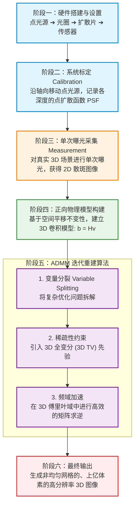

# Lensless Camera

## 流程图 (Flowchart)

```mermaid
graph TD
    %% 定义节点样式
    classDef hardware fill:#e1f5fe,stroke:#0288d1,stroke-width:2px;
    classDef data fill:#fff3e0,stroke:#f57c00,stroke-width:2px;
    classDef model fill:#e8f5e9,stroke:#388e3c,stroke-width:2px;
    classDef algo fill:#f3e5f5,stroke:#7b1fa2,stroke-width:2px;
    classDef result fill:#ffebee,stroke:#d32f2f,stroke-width:2px;

    %% 流程节点
    A["阶段一：硬件搭建与设置<br/>点光源 ➔ 光圈 ➔ 扩散片 ➔ 传感器"]:::hardware
    B["阶段二：系统标定 Calibration<br/>沿轴向移动点光源，记录各深度的点扩散函数 PSF"]:::hardware
    C["阶段三：单次曝光采集 Measurement<br/>对真实 3D 场景进行单次曝光，获得 2D 散斑图像"]:::data
    D["阶段四：正向物理模型构建<br/>基于空间平移不变性，建立 3D 卷积模型: b = Hv"]:::model

    %% 算法子图 - 使用英文 ID 并在括号内加双引号显示中文
    subgraph Stage5 ["阶段五：ADMM 迭代重建算法"]
        direction TB
        E["1. 变量分裂 Variable Splitting<br/>将复杂优化问题拆解"]:::algo
        F["2. 稀疏性约束<br/>引入 3D 全变分 (3D TV) 先验"]:::algo
        G["3. 频域加速<br/>在 3D 傅里叶域中进行高效的矩阵求逆"]:::algo
        
        E --> F --> G
    end

    H["阶段六：最终输出<br/>生成非均匀网格的、上亿体素的高分辨率 3D 图像"]:::result

    %% 连接关系
    A --> B
    B --> C
    C --> D
    D --> E
    G --> H
```

