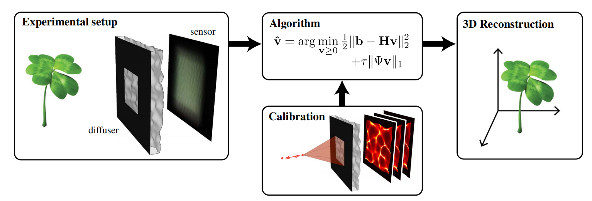
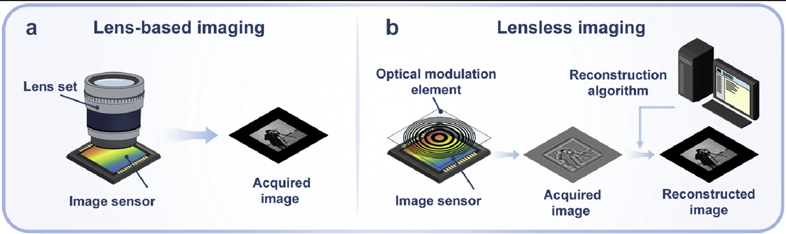
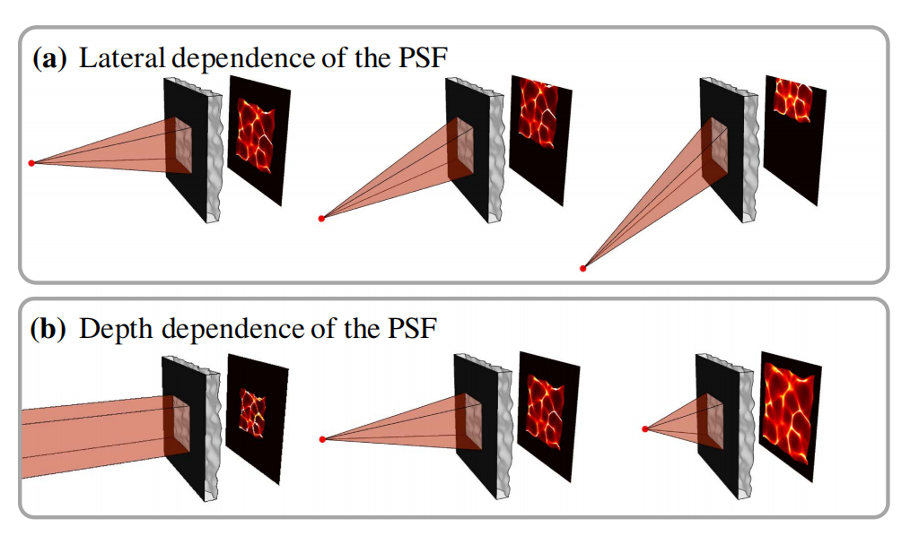
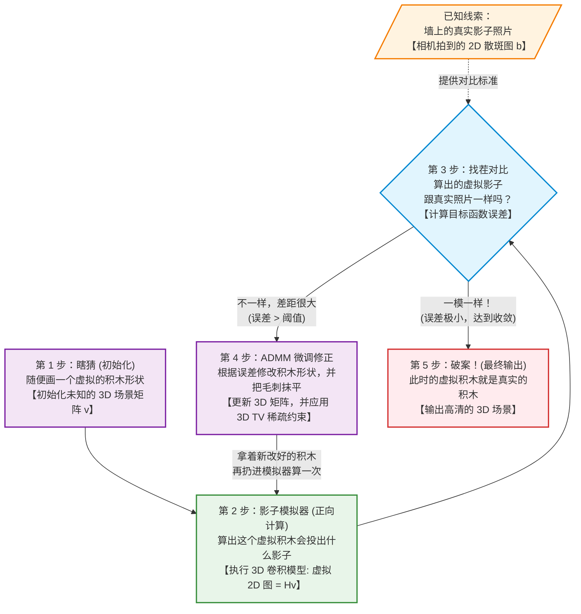
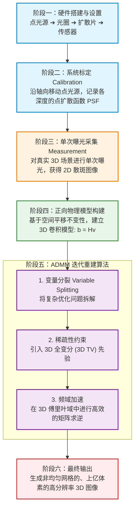

# Lensless Camera

## Diffuser Cam WorkFlow
> lensless imaging = optics（mask） + reconstruction（inverse problem）

> From: DiffuserCam — lensless single-exposure 3D imaging。

### Compare lenscamera with lensless-camera

> From: Lensless camera: Unraveling the breakthroughs and prospects

## Calibration
1. normal lens camera（a point map to point）。lensless：如果需要知道3D空间中的每一个点的信息，需要把点光源放在3D空间中每一个Voxel上拍照标定，非常耗时间。
2. Diffuser cam标定：选择表面平滑的相位扩散片作为diffuser（满足paraxial approximation），因此在同一平面左右移动point source的时候具有Shift invariance。只有在不同深度时光斑图像才会变化。
3. 想要重建多少层，就标定多少张。

> From: DiffuserCam — lensless single-exposure 3D imaging。

> 把一个原本需要在 X、Y、Z 三个维度上进行的全空间暴力扫描，降维成了只在 Z 轴上进行的一维直线扫描。

## 3D Convolution Model

> 把在`calibration`中标定的几百张`PSF`堆叠起来变成一个3维矩阵`H`。

### 公式解释

- **公式（向量形式）**: $b = H*v$
- **直观含义**: 观测向量 `b` 是传感器上得到的 2D 散斑图像（将图像摊平成向量），`v` 是我们要重建的 3D 体积（把每一层平面按顺序展开并连接成向量），`H` 则是把 3D 体积映射到 2D 传感器的线性算子（由标定得到的各深度点扩散函数 PSF 构成）。

## Alternating Diraction Method of Multiplier (ADMM)

根据拍到的2D散斑图，反推真实的3D场景是什么(inverse problem)。

### ADMM如何与3D convolution model协同工作 

## 流程图 (Flowchart)

